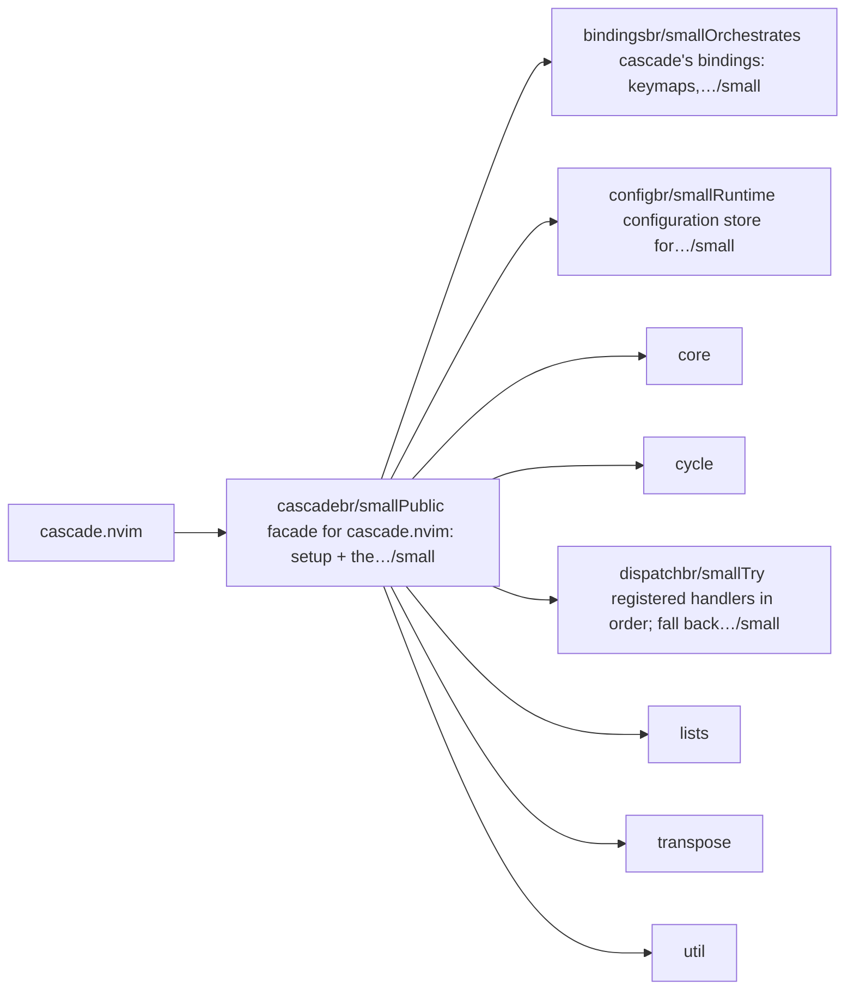
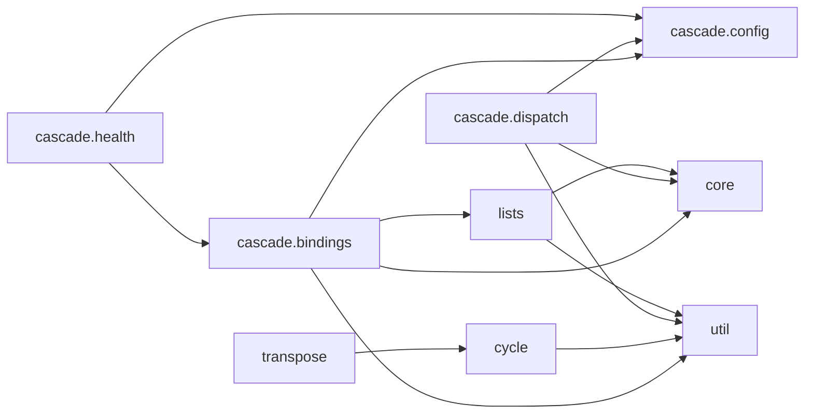

# cascade.nvim — module map

> **Generated** by `documentation`. Do not edit by hand — run `:DocMap`
> (or `nvim --headless -l scripts/gen_map.lua`) to regenerate.

**6 modules** · 6 namespaces · 29 helper files

The [interactive map](index.html) has filtering, full descriptions and
source links; this page is the version the code host renders directly.

## Namespaces

## Dependencies

Which parts of the tree require which, rolled up to the second level.
The [interactive map](index.html)'s **Deps** view has this per module,
in both directions, with load-time and lazy requires told apart.

## Modules

| Module | Description | Fns | Docs |
|---|---|---|---|
| `cascade` | Public facade for cascade.nvim: setup + the action surface. | 47 | [src](../../lua/cascade/init.lua) |
| &nbsp;&nbsp;`cascade.bindings` | Orchestrates cascade's bindings: keymaps, user commands, autocmds. | 1 | [src](../../lua/cascade/bindings/init.lua) |
| &nbsp;&nbsp;`cascade.config` | Runtime configuration store for cascade.nvim. | 4 | [src](../../lua/cascade/config/init.lua) |
| &nbsp;&nbsp;`core` |  |  |  |
| &nbsp;&nbsp;`cycle` |  |  |  |
| &nbsp;&nbsp;&nbsp;&nbsp;`cascade.cycle.types` | Type anchor for the cycle domain. |  | [src](../../lua/cascade/cycle/types/init.lua) |
| &nbsp;&nbsp;`cascade.dispatch` | Try registered handlers in order; fall back to a native key. | 3 | [src](../../lua/cascade/dispatch/init.lua) |
| &nbsp;&nbsp;`lists` |  |  |  |
| &nbsp;&nbsp;&nbsp;&nbsp;`cascade.lists.types` | Type anchor for the list domain. |  | [src](../../lua/cascade/lists/types/init.lua) |
| &nbsp;&nbsp;`transpose` |  |  |  |
| &nbsp;&nbsp;`util` |  |  |  |

## Drift

0 errors · 2 warnings · 9 info

| Severity | Check | Message |
|---|---|---|
| warn | `doc-references-missing` | README.md:229 references 'cascade.dedent', but cascade has no 'dedent' |
| warn | `doc-references-missing` | README.md:229 references 'cascade.indent', but cascade has no 'indent' |

9 informational findings

| Check | Message |
|---|---|
| `missing-readme` | lua/cascade has no README.md |
| `missing-readme` | lua/cascade/bindings has no README.md |
| `missing-readme` | lua/cascade/config has no README.md |
| `missing-readme` | lua/cascade/cycle/types has no README.md |
| `missing-readme` | lua/cascade/dispatch has no README.md |
| `missing-readme` | lua/cascade/lists/types has no README.md |
| `unreferenced-module` | cascade.cycle.types is required by no other file in the tree |
| `unreferenced-module` | cascade.health is required by no other file in the tree |
| `unreferenced-module` | cascade.lists.types is required by no other file in the tree |

